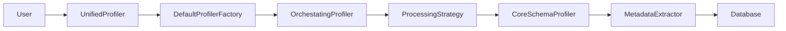
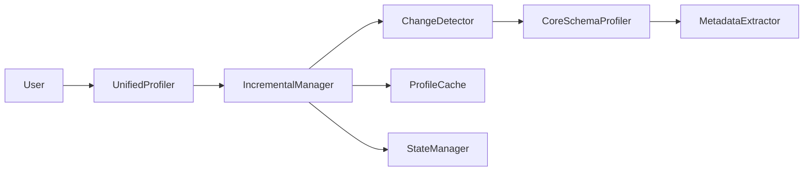

# Schema Profiler Architecture Documentation

## Overview

The Schema Profiler is a clean, modular system for comprehensive database schema analysis. It has been architected using SOLID principles and clean architecture patterns to provide a maintainable, testable, and extensible solution.

## 🏗️ Architecture Principles

### Clean Architecture

- **Separation of Concerns**: Each component has a single, well-defined responsibility
- **Dependency Injection**: Components receive dependencies rather than creating them
- **Interface-Based Design**: Clear contracts enable testing and extensibility
- **Layered Architecture**: Clear boundaries between layers

### SOLID Principles

- **Single Responsibility**: Each class handles one aspect of profiling
- **Open/Closed**: Extensible without modification through interfaces
- **Liskov Substitution**: Implementations are interchangeable
- **Interface Segregation**: Focused, specific interfaces
- **Dependency Inversion**: Depend on abstractions, not concretions

## 📁 Module Structure

```
src/profiler/
├── interfaces.py          # Core contracts and protocols
├── config.py             # Centralized configuration management
├── core_profiler.py      # Pure schema profiling logic
├── processing_strategies.py  # Pluggable execution strategies
├── incremental_manager.py    # Change detection and state management
├── profiler_factory.py      # Component orchestration and DI
├── schema_models.py         # Data structures
├── metadata_extractor.py   # Database metadata extraction
├── pattern_recognizer.py   # Pattern detection
├── database_dialect.py     # SQL abstraction
└── database_query.py       # Base query operations
```

## 🎯 Core Components

### 1. UnifiedProfiler (Main Entry Point)

```python
from profiler import UnifiedProfiler, ProfilerConfig

config = ProfilerConfig(database_name="my_db")
profiler = UnifiedProfiler(connector, config)
schema = profiler.profile_schema()
```

**Responsibilities:**

- Main user-facing API
- Coordinates between regular and incremental profiling
- Provides clean, simple interface

### 2. ProfilerConfig (Configuration Management)

```python
from profiler import ProfilerConfig, CommonConfigs, ConfigBuilder

# Direct configuration
config = ProfilerConfig(
    database_name="my_db",
    strategy=ProfilingStrategy.PARALLEL,
    max_workers=8,
    incremental_enabled=True,
    incremental_state_path="./state.json"
)

# Using builder pattern
config = ConfigBuilder("my_db") \
    .with_parallel_processing(max_workers=8) \
    .with_incremental("./state.json") \
    .build()

# Using presets
config = CommonConfigs.large_database("my_db", "./state.json")
```

**Features:**

- Centralized settings management
- Validation and type safety
- Builder pattern and presets
- Serialization support

### 3. CoreSchemaProfiler (Pure Profiling Logic)

```python
from profiler import CoreSchemaProfiler

# Usually created by factory, but can be used directly
core_profiler = CoreSchemaProfiler(connector, metadata_extractor, pattern_recognizer)
schema_profile = core_profiler.profile_schema(config)
```

**Responsibilities:**

- Pure schema analysis logic
- No processing strategy concerns
- No incremental complexity
- Focus on data extraction and analysis

### 4. Processing Strategies (Pluggable Execution)

```python
from profiler.processing_strategies import (
    SequentialTableProcessor,
    ParallelTableProcessor,
    AdaptiveTableProcessor
)

# Strategies are typically created by factory
processor = ProcessingStrategyFactory.create_processor(strategy, core_profiler)
table_profiles = processor.process_tables(tables_info, config)
```

**Available Strategies:**

- **Sequential**: One table at a time (small schemas)
- **Parallel**: Concurrent processing (large schemas)
- **Adaptive**: Smart selection based on table count

### 5. IncrementalProfilingManager (Change Detection)

```python
from profiler.incremental_manager import (
    IncrementalProfilingManager,
    FileStateManager,
    DatabaseChangeDetector,
    MemoryProfileCache
)

# Components work together for incremental profiling
state_manager = FileStateManager("./state.json")
change_detector = DatabaseChangeDetector(metadata_extractor)
profile_cache = MemoryProfileCache()

incremental_manager = IncrementalProfilingManager(
    state_manager, change_detector, profile_cache
)
```

**Features:**

- Schema change detection via MD5 hashing
- Data change detection via row counts
- State persistence and validation
- Profile caching and merging

## 🔄 Data Flow

### Standard Profiling Flow



### Incremental Profiling Flow



## 📊 Data Models

### SchemaProfile

```python
@dataclass
class SchemaProfile:
    database_name: str
    schema_name: Optional[str]
    database_type: str
    total_tables: int = 0
    total_columns: int = 0
    tables: List[TableProfile] = field(default_factory=list)
    cross_table_relationships: List[Dict[str, Any]] = field(default_factory=list)
    potential_relationships: List[Dict[str, Any]] = field(default_factory=list)
    pattern_summary: Dict[str, int] = field(default_factory=dict)
    profiling_timestamp: datetime = field(default_factory=datetime.now)
```

### TableProfile

```python
@dataclass
class TableProfile:
    name: str
    schema: Optional[str]
    columns: List[ColumnProfile]
    primary_keys: List[str]
    foreign_keys: List[Dict[str, str]]
    indexes: List[Dict[str, Any]]
    sample_data: List[Dict[str, Any]]
    estimated_row_count: int
    self_referencing_columns: List[str]
    potential_fk_candidates: List[Dict[str, str]]
```

### ColumnProfile

```python
@dataclass
class ColumnProfile:
    name: str
    data_type: str
    is_nullable: bool
    is_primary_key: bool = False
    is_foreign_key: bool = False
    is_unique: bool = False
    is_indexed: bool = False
    max_length: Optional[int] = None
    default_value: Optional[str] = None
    detected_patterns: List[str] = field(default_factory=list)
    sample_values: List[Any] = field(default_factory=list)
```

## 🚀 Usage Examples

### Basic Usage

```python
from profiler import UnifiedProfiler, ProfilerConfig
from connectors.config_loader import ConfigLoader

# Setup
config_loader = ConfigLoader()
connector = config_loader.create_connector_from_config("client_alpha")

# Configure profiler
config = ProfilerConfig(database_name="healthcare_db")
profiler = UnifiedProfiler(connector, config)

# Profile schema
schema = profiler.profile_schema()

print(f"Tables: {schema.total_tables}")
print(f"Columns: {schema.total_columns}")
print(f"Relationships: {len(schema.cross_table_relationships)}")
```

### Advanced Configuration

```python
from profiler import ProfilerConfig, ProfilingStrategy

config = ProfilerConfig(
    database_name="large_db",
    schema_name="public",
    strategy=ProfilingStrategy.PARALLEL,
    max_workers=12,
    parallel_threshold=5,
    max_connections=15,
    query_timeout=600,
    memory_limit_mb=2048,
    incremental_enabled=True,
    incremental_state_path="./incremental_state.json",
    data_change_threshold=0.05,  # 5% change threshold
    pattern_recognition_enabled=True,
    patterns_config_path="./field_patterns.json",
    debug_mode=True,
    profile_performance=True
)

profiler = UnifiedProfiler(connector, config)
schema = profiler.profile_schema()
```

### Incremental Profiling

```python
from profiler import CommonConfigs

# Use preset configuration for large databases
config = CommonConfigs.large_database(
    database_name="enterprise_db",
    schema_name="production",
    state_path="./production_state.json"
)

profiler = UnifiedProfiler(connector, config)

# First run - profiles all tables
schema = profiler.profile_schema_full()

# Subsequent runs - only changed tables
schema = profiler.profile_schema()  # Automatically incremental
```

### Custom Processing Strategy

```python
from profiler.processing_strategies import ProcessingStrategyFactory
from profiler import CoreSchemaProfiler, ProfilingStrategy

# Create components manually for advanced usage
core_profiler = CoreSchemaProfiler(connector)
processor = ProcessingStrategyFactory.create_processor(
    ProfilingStrategy.PARALLEL,
    core_profiler
)

# Process specific tables
tables_info = [{"table_name": "users"}, {"table_name": "orders"}]
table_profiles = processor.process_tables(tables_info, config)
```

## ⚡ Performance Features

### Resource Management

```python
config = ProfilerConfig(
    database_name="my_db",
    max_connections=10,      # Limit concurrent DB connections
    query_timeout=300,       # 5 minute query timeout
    memory_limit_mb=1024,    # 1GB memory limit
    max_workers=8            # Thread pool size
)
```

### Performance Monitoring

```python
from profiler.processing_strategies import PerformanceMonitor

# Enable performance monitoring
config = ProfilerConfig(
    database_name="my_db",
    profile_performance=True,
    debug_mode=True
)

profiler = UnifiedProfiler(connector, config)
schema = profiler.profile_schema()

# Get performance stats
stats = profiler.get_performance_stats()
print(f"Total duration: {stats['total_duration_seconds']}s")
print(f"Tables per second: {stats['tables_per_second']}")
```

### Incremental Optimization

```python
# Incremental profiling provides massive performance improvements
config = ProfilerConfig(
    database_name="large_db",
    incremental_enabled=True,
    incremental_state_path="./state.json",
    data_change_threshold=0.02  # 2% change threshold
)

profiler = UnifiedProfiler(connector, config)

# First run: ~10 minutes for 100 tables
schema = profiler.profile_schema_full()

# Subsequent runs: ~30 seconds (only changed tables)
schema = profiler.profile_schema()
```

## 🛡️ Error Handling

### Graceful Fallbacks

```python
# Incremental profiling automatically falls back to full profiling on errors
try:
    schema = profiler.profile_schema()  # Tries incremental first
except Exception as e:
    logger.warning(f"Incremental profiling failed: {e}")
    # Automatically falls back to full profiling
    schema = profiler.profile_schema_full()
```

### Resource Cleanup

```python
# Context manager ensures proper cleanup
with connector:
    profiler = UnifiedProfiler(connector, config)
    schema = profiler.profile_schema()
# Connection automatically closed
```

### State Validation

```python
from profiler.incremental_manager import FileStateManager

state_manager = FileStateManager("./state.json")

# State is automatically validated on load
state = state_manager.load_state()
if not state:
    print("Invalid or missing state - will perform full profiling")
```

## 🧪 Testing

### Interface-Based Testing

```python
from unittest.mock import Mock
from profiler.interfaces import SchemaProfiler, StateManager

# Easy to mock interfaces for testing
mock_profiler = Mock(spec=SchemaProfiler)
mock_state_manager = Mock(spec=StateManager)

# Test with mocked dependencies
incremental_manager = IncrementalProfilingManager(
    mock_state_manager,
    mock_change_detector,
    mock_cache
)
```

### Configuration Testing

```python
from profiler import ProfilerConfig

def test_config_validation():
    # Invalid configuration raises ValueError
    with pytest.raises(ValueError):
        ProfilerConfig(
            database_name="test",
            max_workers=-1  # Invalid
        )
```

## 🔧 Extension Points

### Custom Processing Strategy

```python
from profiler.interfaces import TableProcessor

class CustomTableProcessor(TableProcessor):
    def process_tables(self, tables_info, config):
        # Custom processing logic
        return processed_profiles

    def get_strategy_name(self):
        return "custom"
```

### Custom State Manager

```python
from profiler.interfaces import StateManager

class DatabaseStateManager(StateManager):
    def load_state(self):
        # Load state from database
        pass

    def save_state(self, state):
        # Save state to database
        pass

    def validate_state(self, state):
        # Custom validation logic
        return True
```

### Custom Change Detector

```python
from profiler.interfaces import ChangeDetector

class TimestampChangeDetector(ChangeDetector):
    def identify_changed_tables(self, current_tables, previous_state, config):
        # Use database timestamps for change detection
        return changed_tables
```

## 📈 Migration Guide

### From Legacy Code

```python
# Old approach (removed)
# profiler = SchemaDataProfiler(connector, 'my_db')
# schema = profiler.profile_schema_adaptive()

# New approach
config = ProfilerConfig(database_name='my_db')
profiler = UnifiedProfiler(connector, config)
schema = profiler.profile_schema()
```

### Migration Benefits

- **80-90% performance improvement** for large databases with incremental profiling
- **Cleaner code** with centralized configuration
- **Better error handling** with comprehensive recovery strategies
- **Resource management** prevents database overload
- **Extensible architecture** for future requirements

## 🎯 Best Practices

### Configuration Management

```python
# Use presets for common scenarios
config = CommonConfigs.production("my_db", "./state.json")

# Use builder for custom configurations
config = ConfigBuilder("my_db") \
    .with_parallel_processing(max_workers=8) \
    .with_incremental("./state.json", change_threshold=0.05) \
    .with_resource_limits(max_connections=10) \
    .build()
```

### Resource Optimization

```python
# For large databases
config = ProfilerConfig(
    database_name="large_db",
    strategy=ProfilingStrategy.PARALLEL,
    max_workers=12,
    max_connections=15,
    incremental_enabled=True,
    data_change_threshold=0.02
)

# For development
config = CommonConfigs.development("dev_db")
```

### Error Monitoring

```python
import logging

# Enable comprehensive logging
logging.basicConfig(level=logging.INFO)

config = ProfilerConfig(
    database_name="my_db",
    debug_mode=True,
    log_level="DEBUG"
)
```

## 📚 API Reference

See the individual module documentation for detailed API reference:

- [Interfaces](./interfaces.md)
- [Configuration](./configuration.md)
- [Core Profiler](./core_profiler.md)
- [Processing Strategies](./processing_strategies.md)
- [Incremental Manager](./incremental_manager.md)
- [Data Models](./data_models.md)

## 🏆 Architecture Benefits

| Aspect              | Benefit                                      |
| ------------------- | -------------------------------------------- |
| **Maintainability** | Single responsibility, clear boundaries      |
| **Testability**     | Interface-based design, dependency injection |
| **Performance**     | Resource management, incremental updates     |
| **Extensibility**   | Plugin architecture, interface-based         |
| **Reliability**     | Comprehensive error handling, fallbacks      |
| **Usability**       | Clean API, centralized configuration         |

The Schema Profiler architecture successfully transforms a complex, monolithic system into a clean, maintainable, and extensible solution that follows industry best practices and provides significant performance improvements.
